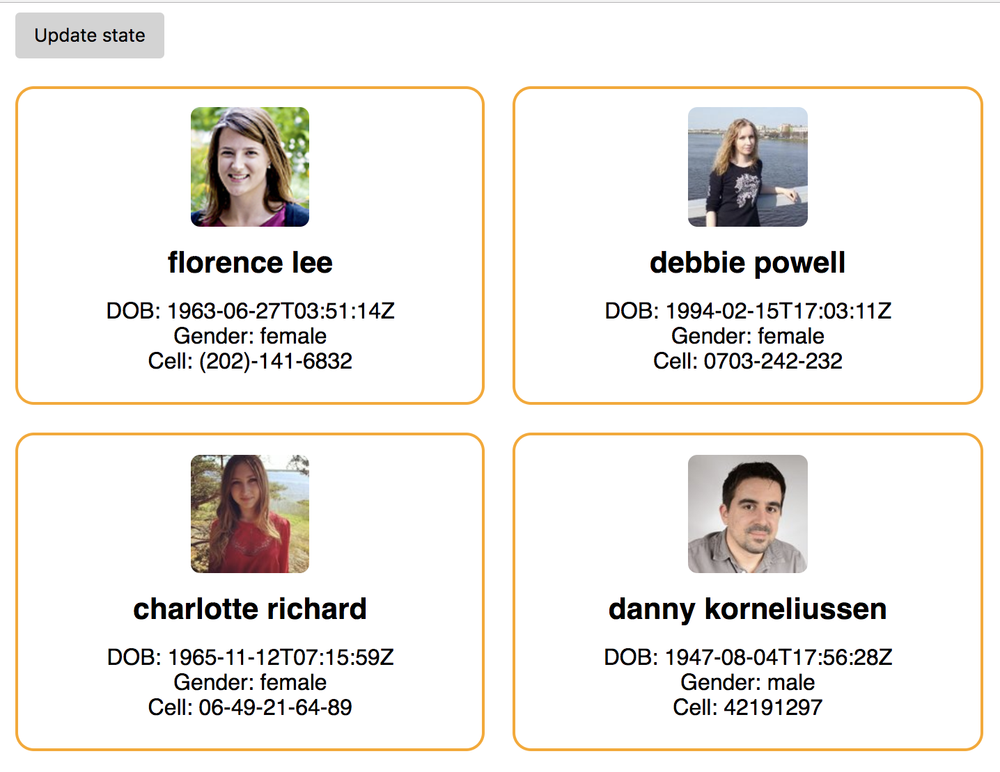

# RandomUsers Project

- This is a demo random users project, built with ReactJS. 
- It displays a list of random users' information. 

## App Functionalty

The users will be able to get a new list of users by

- clicking on 'Update state' button.
- refreshing the page every five minutes.

## App Screenshot

## Installation instructions
- git clone https://github.com/mavisluan/random-users.git
- cd random-users
- yarn install
- yarn start
